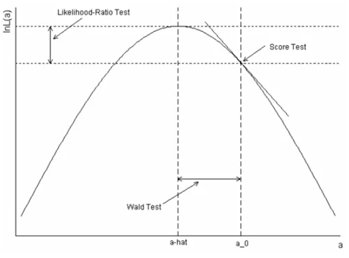
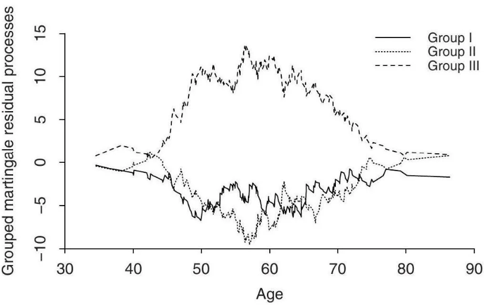
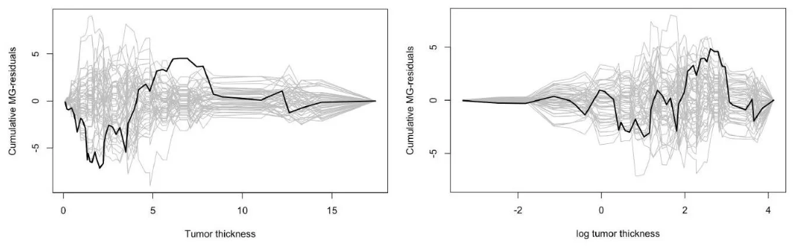

Review : 신예은 교수님 강의노트 Lecture 6, 7

Review : Aalen, O., Borgan, O., & Gjessing, H. (2008). *Survival and event history analysis: a process point of view*. Springer Science & Business Media. Chapter 4

## Regression for counting process

$n$개의 sample 개체가 있다고 가정하고, 그것에 대응되면 counting process $N_i(t)$를 고려해 보자.

그러면, survival data에서는 event가 일어날 때 $N_i(t) = 1$이 되고 일어나지 않을 때 $N_i(t) = 0$이 된다.

이 때, $N_i (t)$에 대해서 regression modeling을 하고 싶을 때 주로 사용하는 방법은

 

$$
\begin{equation}d N_i(t)=\lambda_i(t) d t+d M_i(t)\end{equation}
$$

을 이용해서, 공변량이 intensity process $\lambda_i (t)$에 어느 정도 영향을 끼치는지 분석하는 것이다.

이제, $t$에서의 공변량(covariate process)들이 다음과 같이 정의될 때,

$$
\begin{equation}\boldsymbol{x}_i(t)=\left\{x_{i 1}(t), x_{i 2}(t), \ldots, x_{i p}(t)\right\}^{\top}\end{equation}
$$

intensity process $\lambda_i (t)$는 다음과 같이 나타낼 수 있다.

$$
\begin{equation}\lambda_i(t)=Y_i(t) \alpha\left(t \mid \boldsymbol{x}_i\right)\end{equation}
$$

이 때, covariate process가,

- 고정된 공변량은 사전에 ($t=0$에서) 측정되어야 하며 연구 전체 기간 동안 고정된 상태로 유지
- $t$ 시점에서의 $\boldsymbol{x}_i(t)$ 값은 $t$ 직전에 이미 알려져 있음

을 만족하는, 즉 predictable process임을 먼저 가정하자.

## Relative Risk Model

각 개체 $i$의 hazard rate가

$$
\begin{equation}\alpha\left(t \mid \boldsymbol{x}_i\right)=\alpha_0(t) r\left(\boldsymbol{\beta}, \boldsymbol{x}_i(t)\right)\end{equation}
$$

과 같은 형태를 가지고 있다고 가정하자. 여기서 $\alpha_0(t)$는 baseline hazard이고, $r\left(\boldsymbol{\beta}, \boldsymbol{x}_i(t)\right)$는 relative risk라고 한다. 여기서 $\alpha_0(t)$는 모든 공변량이 $0$일 때의 hazard라 하기 위해, $r(\boldsymbol{\beta}, \boldsymbol{0}) = 1$을 가정한다.

이 모델은 보통, semiparametric model로 불린다. 이유는, nonparametric part $\alpha_0(t)$와 parametric part $r\left(\boldsymbol{\beta}, \boldsymbol{x}_i(t)\right)$가 섞여있기 때문이다.

## Cox regression model

 $r\left(\boldsymbol{\beta}, \boldsymbol{x}_i(t)\right)$에서 제일 널리 쓰이는 선택지는

$$
\begin{equation}r\left(\boldsymbol{\beta}, \boldsymbol{x}_i(t)\right)=\exp \left(\boldsymbol{\beta}^T \boldsymbol{x}_i(t)\right)=\exp \left(\beta_1 x_{i 1}(t)+\cdots+\beta_p x_{i p}(t)\right)\end{equation}
$$

이고, 이렇게 될 때 이 모델이 유명한 **Cox regression Model**이다.

## Why the model is Relative Risk Model?

이 모델이 왜 Relative risk 모델일까? 간단한 예시를 고려해 보자.

$\boldsymbol{x}_1 (t) + e_j = \boldsymbol{x}_2 (t)$인 두 covariate를 고려하자. 그러면,

$$
\begin{equation}\frac{\alpha\left(t \mid \boldsymbol{x}_2\right)}{\alpha\left(t \mid \boldsymbol{x}_1\right)}=\frac{\alpha_0(t) \exp \left(\boldsymbol{\beta}^T \boldsymbol{x}_2(t)\right)}{\alpha_0(t) \exp \left(\boldsymbol{\beta}^T \boldsymbol{x}_1(t)\right)}=\exp \left\{\boldsymbol{\beta}^T\left(\boldsymbol{x}_2(t)-\boldsymbol{x}_1(t)\right)\right\}=\exp \left(\beta_j\right)\end{equation}
$$

이 성립한다. 여기서 relative risk의 뜻을 알 수 있다.

## Partial Likelihood

추정에는, nonparametric baseline으로 인해 likelihood 기반의 추정이 불가능하다. 따라서 우리는 *partial likelihood*를 고려할 것이다.

$N_{i}(t)$의 intensity가

$$
\begin{equation}\lambda_i(t)=Y_i(t) \alpha\left(t \mid \boldsymbol{x}_i\right)=Y_i(t) \alpha_0(t) r\left(\boldsymbol{\beta}, \boldsymbol{x}_i(t)\right)\end{equation}
$$

로 주어지고, aggregated process $N_.(t)=\sum_{i=1}^n N_i(t)$의 경우, intensity는

$$
\begin{equation}\lambda .(t)=\sum_{i=1}^n \lambda_i(t)=\sum_{\ell=1}^n Y_{\ell}(t) \alpha_0(t) r\left(\boldsymbol{\beta}, \boldsymbol{x}_{\ell}(t)\right)\end{equation}
$$

가 된다. 이 때, conditional probability $\pi(i \mid t)$를 고려하자. 이를 조금 더 직관적으로 해석하면, 고정된 $t$ 시점에 at risk로 남아있는 개체들 중 나의 intensity가 어느 정도인지 나타내는 것으로,

$$
\begin{equation}\begin{aligned}\pi(i \mid t) & =P\left(d N_i(t)=1 \mid d N .(t)=1, \mathcal{F}_{t-}\right)=\frac{P\left(d N_i(t)=1 \mid \mathcal{F}_{t-}\right)}{P\left(d N \cdot(t)=1 \mid \mathcal{F}_{t-}\right)} \\& =\frac{\lambda_i(t)}{\lambda(t)}=\frac{Y_i(t) r\left(\boldsymbol{\beta}, \boldsymbol{x}_i(t)\right)}{\sum_{\ell=1}^n Y_{\ell}(t) r\left(\boldsymbol{\beta}, \boldsymbol{x}_{\ell}(t)\right)}\end{aligned}\end{equation}
$$

으로 나타낼 수 있다. 그러면 $N_i (t)$의 intensity process는

$$
\begin{equation}\lambda_i(t)=\lambda .(t) \pi(i \mid t)\end{equation}
$$

로 얻을 수 있고, 이 때 event time $T_1 < T_2 < \ldots$ 에서의 $\pi(i \mid t)$들을 곱함으로써, partial likelihood를 정의한다.

Partial Likelihood의 자세한 식은 다음과 같다. 

$$
\begin{equation}L(\boldsymbol{\beta})=\prod_{T_j} \pi\left(i_j \mid T_j\right)=\prod_{T_j} \frac{Y_{i_j}(T_j) r\left(\boldsymbol{\beta}, \boldsymbol{x}_{i_j}(T_j)\right)}{\sum_{\ell=1}^n Y_{\ell}(T_j) r\left(\boldsymbol{\beta}, \boldsymbol{x}_{\ell}(T_j)\right)}=\prod_{T_j} \frac{r\left(\boldsymbol{\beta}, \boldsymbol{x}_{i_j}(T_j)\right)}{\sum_{\ell \in \mathcal{R}_j}^n r\left(\boldsymbol{\beta}, \boldsymbol{x}_{\ell}(T_j)\right)}\end{equation}
$$

여기서, $\mathcal{R}_j=\left\{\ell \mid Y_{\ell}\left(T_j\right)=1\right\}$이다.

## 가설 검정

$H_0: \boldsymbol{\beta}=\boldsymbol{\beta}_0$에 대한 검정통계량은 일반적인 likelihood framework를 기반으로 한다.

1. Likelihood Ratio Statistic

$$
\chi_{L R}^2=2\left\{\log L(\widehat{\boldsymbol{\beta}})-\log L\left(\boldsymbol{\beta}_0\right)\right\}
$$

- 최대화된 우도 자체를 기반으로 함
- 강력하고 신뢰할 수 있는 검정방법 (황금 표준)
- 계산이 복잡함

2. Score Test Statistic

$$
\chi_{S C}^2=\mathbf{U}\left(\boldsymbol{\beta}_0\right)^T \mathscr{I}\left(\boldsymbol{\beta}_0\right)^{-1} \mathbf{U}\left(\boldsymbol{\beta}_0\right)
$$

- 스코어 함수 $\mathbf{U}(\boldsymbol{\beta})=\partial \log L(\boldsymbol{\beta}) / \partial \boldsymbol{\beta}$를 기반으로 함
- $\mathbf{U}(\boldsymbol{\beta})$의 평균이 0이고 공분산이 $\mathscr{I}(\boldsymbol{\beta})$인 점근적 정규성을 기반으로 함
- log-rank test와 marginally equivalent한 성질을 가지고 있다.

3. Wald Test Statistic

$$
\chi_W^2=\left(\widehat{\boldsymbol{\beta}}-\boldsymbol{\beta}_0\right)^T \mathscr{I}(\widehat{\boldsymbol{\beta}})\left(\widehat{\boldsymbol{\beta}}-\boldsymbol{\beta}_0\right)
$$

- $\mathscr{I}(\widehat{\boldsymbol{\beta}})$로 표준화된 추정량을 기반으로 함
- $\widehat{\boldsymbol{\beta}}$의 점근적 정규성을 기반으로 함
- 단순하고 계산이 쉬움

  

모든 검정통계량은 유한 표본에서는 서로 다르지만, 점근적으로는 동등하며 귀무가설 하에서 자유도가 $p$인 카이제곱 분포를 따른다.

모든 검정은 $p$개의 회귀계수 중 $r$개 또는 이들의 $r$개의 선형 제약에 대한 검정을 위해 국소 또는 복합 귀무가설로 일반화될 수 있다.

## Cumulative Hazard 추정

aggregated counting process $N_.(t)$의 intensity process는, 식 (8)에서 다음과 같이 주어진다.

$$
\begin{equation}\lambda .(t)=\left(\sum_{\ell=1}^{n} Y_{\ell}(t) r\left(\boldsymbol{\beta}, \boldsymbol{x}_{\ell}(t)\right)\right) \alpha_{0}(t)\end{equation}
$$

$\boldsymbol{\beta}$가 알려져 있다면, 이는 multiplicative intensity model의 예시이며, $A_{0}(t)$는 Nelson-Aalen 추정량으로, 다음과 같이 추정할 수 있다.

$$
\begin{equation}\widehat{A}_{0}(t ; \boldsymbol{\beta})=\int_{0}^{t} \frac{d N \cdot(u)}{\sum_{\ell=1}^{n} Y_{\ell}(u) r\left(\boldsymbol{\beta}, \boldsymbol{x}_{\ell}(u)\right)}\end{equation}
$$

하지만 실제로 $\boldsymbol{\beta}$는 알려지지 않았으므로, $\widehat{\boldsymbol{\beta}}$로 대체하여 다음과 같은 cumulative baseline hazard을 얻는다.

$$
\begin{equation}\widehat{A}_{0}(t)=\int_{0}^{t} \frac{d N .(u)}{\sum_{\ell=1}^{n} Y_{\ell}(u) r\left(\widehat{\boldsymbol{\beta}}, \boldsymbol{x}_{\ell}(u)\right)}=\sum_{T_{j} \leq t} \frac{1}{\sum_{\ell \in \mathcal{R}_{j}} r\left(\widehat{\boldsymbol{\beta}}, \boldsymbol{x}_{\ell}\left(T_{j}\right)\right)}\end{equation}
$$

이를 **Breslow Estimator**이라 부른다.

만약 모든 covariate들이 fix되어 있다면, 주어진 $\boldsymbol{x}_{0}$를 가진 개체에 대응하는 (조정된) cumulative hazard는 다음과 같다.

$$
\begin{equation}A\left(t \mid \boldsymbol{x}_{0}\right)=\int_{0}^{t} \alpha\left(u \mid \boldsymbol{x}_{0}\right) d u=r\left(\boldsymbol{\beta}, \boldsymbol{x}_{0}\right) A_{0}(u)\end{equation}
$$

이는 다음과 같이 추정할 수 있다.

$$
\begin{equation}\widehat{A}\left(t \mid \boldsymbol{x}_{0}\right)=r\left(\widehat{\boldsymbol{\beta}}, \boldsymbol{x}_{0}\right) \widehat{A}_{0}(t)\end{equation}
$$

또한, 일부 covariate가 시간에 따라 변할 때, 주어진 covariate process $\left\{\boldsymbol{x}_{0}(s) ; 0 < s \leq t\right\}$에 대응하는 cumulative hazard는 다음과 같다.

$$
\begin{equation}A\left(t \mid \boldsymbol{x}_{0}\right)=\int_{0}^{t} r\left(\boldsymbol{\beta}, \boldsymbol{x}_{0}(u)\right) \alpha_{0}(u) d u\end{equation}
$$

이는 다음과 같이 추정할 수 있다.

$$
\begin{equation}\widehat{A}\left(t \mid \boldsymbol{x}_{0}\right)=\int_{0}^{t} r\left(\widehat{\boldsymbol{\beta}}, \boldsymbol{x}_{0}(u)\right) d \widehat{A}_{0}(u)=\sum_{T_{j} \leq t} \frac{r\left(\widehat{\boldsymbol{\beta}}, \boldsymbol{x}_{0}\left(T_{j}\right)\right)}{\sum_{l \in \mathscr{R}_{j}} r\left(\widehat{\boldsymbol{\beta}}, \boldsymbol{x}_{l}\left(T_{j}\right)\right)}\end{equation}
$$

주어진 $t$에 대해, $\widehat{A}\left(t \mid \boldsymbol{x}_{0}\right)$는 그 진짜 값 주변에서 점근적으로 정규분포를 따르며, 분산은 이후에 보일 것이다.

## **Estimation of survival probabilities**

Survival function $S\left(t \mid \boldsymbol{x}_{0}\right)$는 다음과 같이 product-integral로 표현할 수 있다.

$$
\begin{equation}S\left(t \mid \boldsymbol{x}_{0}\right)=\bigwedge_{u \leq t}\left\{1-d A\left(u \mid \boldsymbol{x}_{0}\right)\right\}\end{equation}
$$

$\widehat{A}\left(t \mid \boldsymbol{x}_{0}\right)$를 대입하면 다음과 같은 Kaplan-Meier 형태의 추정량을 얻는다.

$$
\begin{equation}\widehat{S}\left(t \mid \boldsymbol{x}_{0}\right)=\prod_{u \leq t}\left\{1-d \widehat{A}\left(u \mid \boldsymbol{x}_{0}\right)\right\}=\prod_{T_{j} \leq t}\left\{1-\triangle \widehat{A}\left(T_{j} \mid \boldsymbol{x}_{0}\right)\right\}\end{equation}
$$

이 추정량은 진짜 값 주변에서 점근적으로 정규분포를 따르며 분산을 가진다.

또는 다음과 같은 추정량을 사용할 수도 있다.

$$
\begin{equation}\widetilde{S}\left(t \mid \boldsymbol{x}_{0}\right)=\exp \left\{-\hat{A}\left(t \mid \boldsymbol{x}_{0}\right)\right\}\end{equation}
$$

실제로는 두 추정량 간의 차이가 크지 않다.

## Martingale residual processes

Cumulative intensity processes를 다음과 같이 정의한다.

$$
\Lambda_{i}(t)=\int_{0}^{t} \lambda_{i}(u) d u=\int_{0}^{t} Y_{i}(u) r\left(\boldsymbol{\beta}, \boldsymbol{x}_{i}(u)\right) \alpha_{0}(u) d u
$$

Relative risk regression model이 참일 때(즉, 모형이 올바르게 fitting되었을 때), $i = 1,2,...,n$에 대하여 다음이 martingale이 된다.

$$
M_{i}(t)=N_{i}(t)-\Lambda_{i}(t)
$$

추정된 cumulative intensity process는 다음과 같다.

$$
\widehat{\Lambda}_{i}(t)=\int_{0}^{t} Y_{i}(u) r\left(\widehat{\boldsymbol{\beta}}, \boldsymbol{x}_{i}(u)\right) d \widehat{A}_{0}(u)=\sum_{T_{j} \leq t} \frac{Y_i (T_j)r\left(\widehat{\boldsymbol{\beta}}, \boldsymbol{x}_{i}\left(T_{j}\right)\right)}{\sum_{\ell \in \mathcal{R}_{j}} r\left(\widehat{\boldsymbol{\beta}}, \boldsymbol{x}_{\ell}\left(T_{j}\right)\right)}
$$

여기서 $\widehat{\boldsymbol{\beta}}$는 maximum partial likelihood estimator이며 $\widehat{A}_{0}$는 Breslow estimator이다.

Martingale residual process는 다음과 같이 정의된다.

$$
\widehat{M}_{i}(t)=N_{i}(t)-\widehat{\Lambda}_{i}(t)
$$

그리고 martingale residual은 다음과 같다.

$$
\widehat{M}_{i}=\widehat{M}_{i}(\tau)=N_{i}(\tau)-\widehat{\Lambda}_{i}(\tau)
$$

여기서 $\tau$는 연구의 상한 시점이다.

## Model Check - Martingale Point

### Grouped martingale residual process

개체가 시간이 지남에 따라 한 그룹에서 다른 그룹으로 이동할 수 있는 그룹들을 $J=1,\ldots,G$로 표시하고, 시간 $u$에서 그룹 $J$에 속한 모든 개체의 집합을 $J(u)$로 표시한다. 그룹 $J$의 martingale residual process는 다음과 같은 형태를 가진다.

$$
\widehat{M}_{J}(t)=\int_{0}^{t} \sum_{i \in J(u)} d \widehat{M}_{i}(u)=N_{J}(t)-\sum_{T_{j} \leq t} \frac{\sum_{i \in \mathcal{R}_{j} \cap J\left(T_{j}\right)} r\left(\widehat{\boldsymbol{\beta}}, \boldsymbol{x}_{i}\left(T_{j}\right)\right)}{\sum_{l \in \mathcal{R}_{j}} r\left(\widehat{\boldsymbol{\beta}}, \boldsymbol{x}_{l}\left(T_{j}\right)\right)}
$$

- 수식 자세히 들여다보기
    
    $$
    \begin{aligned}\widehat{M}_{J}(t)& =\int_{0}^{t} \sum_{i \in J(u)} d \widehat{M}_{i}(u) \\ & =\int_0^t \sum_{i \in J(u)} d N_i(u)-\int_0^t \sum_{i \in J(u)} d \widehat{\Lambda}_i(t) \\& =\sum_{i \in J(a)} \int_0^t d N_i(u)-\sum_{i \in J(u)} \int_0^t d \hat{\Lambda}_i(t)\\&=N_{J}(t)-\sum_{T_{j} \leq t} \frac{\sum_{i \in \mathcal{R}_{j} \cap J\left(T_{j}\right)} r\left(\widehat{\boldsymbol{\beta}}, \boldsymbol{x}_{i}\left(T_{j}\right)\right)}{\sum_{l \in \mathcal{R}_{j}} r\left(\widehat{\boldsymbol{\beta}}, \boldsymbol{x}_{l}\left(T_{j}\right)\right)}\end{aligned}
    
    $$
    

여기서 $N_J(t)$는 $[0,t]$ 구간에서 그룹 $J$에서 관찰된 사건의 수이며, 마지막 항은 모형이 참일 때 그룹에서 예상되는 사건의 수에 대한 추정치이다.

따라서 귀무가설 하에서 grouped martingale residual processes는 martingale이 되며, 0을 중심으로 변동할 것으로 예상된다. 

Chi-squared goodness-of-fit test는 공변량과 시간의 공간을 분할함으로써 수행될 수 있는데, 이는 다소 임의적일 수 있다.

  

  

위 그림은 우라늄 광부 데이터에 대한 grouped martingale residual processes를 보여준다. 누적 radon exposure에 따라 Group I (500 WLMs 미만), Group II (500-1500 WLMs), Group III (1500 WLMs 초과)로 그룹화하였다. 60세 전후로 연령을 구분했을 때, chi-square test의 p-value는 0.038로, 그룹에 따라 Model이 다르며, relative risk 모델 자체는 적합하지 않다는 것을 시사한다.

### Cumulative sum of martingale residual processes

모형 진단은 더 일반적으로 다음과 같은 multivariate stochastic process을 기반으로 할 수 있다

$$
W(t, \boldsymbol{x})=\int_{0}^{t} \sum_{i=1}^{n} f\left(\boldsymbol{x}_{i}\right) I\left(\boldsymbol{x}_{i} \leq \boldsymbol{x}\right) d \widehat{M}_{i}(u)
$$

여기서 $f$는 알려진 smooth function이며, 그 때 null distribution은 Monte Carlo simulation을 통해 근사될 수 있다. 0을 중심으로 얼마나 변동하는지에 대한 자연스러운 측도는 그것 supremum이다. 이는 Kolmogorov's supremum test와 Pearson's chi-squared test의 관계와 유사하게, grouped test의 일반화임을 주목하자.

실용적인 목적과 그래픽 검정의 용이성을 위해, 다음과 같은 특수한 경우들에 초점을 맞춘다. (직관적인 이해가 좀 필요할 듯..)

(1) $k$번째 공변량에 대해 연구 종료 시점 $\tau$까지의 $W(t,\boldsymbol{x})$의 특수한 경우를 고려해보자. (즉, $f(\boldsymbol{x})=\mathbf{1}$, $k' \neq k$인 모든 $k'$에 대해 $x_{k'}=\infty$, $t=\infty$):

$$
\begin{aligned}W_{k}(x) & =\sum_{i=1}^{n} I\left(x_{i k} \leq x\right) \widehat{M}_{i} \\& =\sum_{i=1}^{n} I\left(x_{i k} \leq x\right) N_{i}(\tau)-\sum_{T_{j}} \sum_{i \in \mathcal{R}_{j}} I\left(x_{i k} \leq x\right) \frac{r\left(\widehat{\boldsymbol{\beta}}, \boldsymbol{x}_{i}\left(T_{j}\right)\right)}{\sum_{l \in \mathcal{R}_{j}} r\left(\widehat{\boldsymbol{\beta}}, \boldsymbol{x}_{l}\left(T_{j}\right)\right)}\end{aligned}
$$

여기서 두 항은 공변량 값 $\leq x$에 대한 관찰된 실패 수와 기대 실패 수이다. 검정 통계량은 다음과 같다:

$$
\widehat{S}_{k}=\sup _{x}\left|\widehat{W}_{k}(x)\right|
$$

귀무가설 하에서 시뮬레이션된 과정 $\widehat{W}_{k}(x)$와 함께, p-value는 관찰된 과정에 해당하는 $s_k=\sup_x|w_k(x)|$에 대해 $P(\widehat{S}_{k} \geq s_k)$로 근사될 수 있다.

  

위 그림은 melanoma 데이터에 대해 모형이 올바르게 지정되었다고 가정할 때, 시뮬레이션된 과정(회색)과 함께 관찰된 검정 과정(검은색)을 보여준다. 왼쪽은 변환되지 않은 종양 두께에 대한 residual을 보여주며(p-value=0.056), 이는 모형이 얇은 종양에 대해 너무 많은 사망을 예측함을 시사한다. 오른쪽은 로그 종양 두께에 대한 것으로(p-value=0.314), 모형이 올바르게 지정되었음을 시사한다.

(2) proportional hazards를 검정하기 위한 또 다른 특수한 경우는 $k$번째 공변량의 score process이다 (즉, $f(\boldsymbol{x})=\boldsymbol{x}$, 모든 $k$에 대해 $x_k=\infty$):

$$
U_{k}(t)=\sum_{i=1}^{n} x_{i k} \widehat{M}_{i}(t)=\sum_{i=1}^{n} x_{i k} N_{i}(t)-\sum_{T_{j} \leq t} \sum_{i \in \mathcal{R}_{j}} x_{i k} \frac{r\left(\widehat{\boldsymbol{\beta}}, \boldsymbol{x}_{i}\left(T_{j}\right)\right)}{\left.\sum_{l \in \mathcal{R}_{j}} r\left(\widehat{\boldsymbol{\beta}}, \boldsymbol{x}_{l}\left(T_{j}\right)\right)\right)}
$$

각 $k$에 대한 proportional hazard 검정 통계량은 $\sup_t|U_k(t)|$이며, 전체적으로는 $\sup_t\|U(t)\|$이다. p-value는 앞선 경우와 유사하게 구할 수 있다.

  

위 그림은 melanoma 데이터에서 ulceration과 log tumor thickness에 대한 Cox model의 standardized score process를 시간에 따라 표시한 것이다. p-value가 각각 0.037과 0.017로, nonproportionality를 시사한다.

## **Model check - Cox model**

이제, 6장에서 배운 Cox proportional 모델에 대해 살펴보자.

Cox model의 진단은 martingale 관점에 비해 일반적으로 더욱 간단하고 신속하게 이루어질 수 있습니다. 고정된 covariates $\boldsymbol{x}=\left(x_{1}, \boldsymbol{x}_{2}^{T}\right)^{T}=\left(x_{1}, x_{2}, \ldots, x_{p}\right)^{T}$ 및 $\boldsymbol{\beta}=\left(\beta_{1}, \boldsymbol{\beta}_{2}^{T}\right)^{T}=\left(\beta_{1}, \beta_{2}, \ldots, \beta_{p}\right)^{T}$를 포함하는 Cox regression model을 살펴보도록 하겠습니다.

$$
\alpha(t \mid x)=\alpha_{0}(t) \exp \left(\boldsymbol{\beta}^{T} \boldsymbol{x}\right)
$$

이러한 모델은 크게 두 가지 중요한 가정을 전제로 합니다. 바로 log-linearity와 proportionality입니다.

### Log-linearity 가정

Log-linearity는 다음과 같은 수식으로 표현됩니다.

$$
\log \alpha(t \mid x)=\log \alpha_{0}(t)+\boldsymbol{\beta}^{T} \boldsymbol{x}
$$

이를 검증하기 위해, 수치형 covariate $x_1$에 대해서는 penalized smoothing spline $s\left(x_{1}\right)$을 적합하고, 나머지 covariates $\boldsymbol{x}_{2}$에 대해서는 log-linearity를 가정한 모델을 고려해봅니다.

$$
\alpha(t \mid x)=\alpha_{0}(t) \exp \left(s\left(x_{1}\right)+\boldsymbol{\beta}_{2}^{T} \boldsymbol{x}_{2}\right)
$$

이때 $\hat{s}\left(x_{1}\right)$의 형태를 통해 선형성을 평가할 수 있습니다. 만약 선형성이 확보되지 않는다면, covariate의 변환이나 그룹화를 고려해볼 수 있습니다.

### Proportional Hazards 가정

Proportional hazards 가정은 다음과 같이 표현됩니다.

$$
\frac{\alpha\left(t \mid x_{1}+1, \boldsymbol{x}_{2}\right)}{\alpha\left(t \mid x_{1}, \boldsymbol{x}_{2}\right)}=\exp \left(\beta_{1}\right)
$$

이 가정의 검증은 크게 두 가지 방법으로 수행할 수 있습니다.

### 1. 그래픽을 통한 검증

나머지 covariates $\boldsymbol{x}_{2}$에 대해 proportionality가 성립한다고 가정할 때, $x_1$에 대한 proportionality가 성립한다면 다음이 성립합니다.

$$
\alpha(t \mid \boldsymbol{x})=\alpha_{0}(t) \exp \left(\beta_{1} x_{1}\right) \exp \left(\boldsymbol{\beta}_{2}^{T} \boldsymbol{x}_{2}\right)
$$

이는 stratified Cox model을 통해 검증할 수 있습니다. stratum $s$에 대해 다음과 같은 모델을 고려합니다.

$$
\alpha(t \mid \boldsymbol{x}(s))=\alpha_{s 0}(t) \exp \left(\boldsymbol{\beta}_{2}^{T} \boldsymbol{x}_{2}\right)
$$

여기서 categorical $x_1$ 혹은 grouped continuous $x_1$의 level로 정의된 stratum $s$에 대한 (cumulative) baseline hazard는 다음과 같습니다.

$$
\alpha_{s 0}(t)=\alpha_{0}(t) \exp \left(\beta_{1} x_{1}\right), \text { or equivalently, } \log \left(A_{s 0}(t)\right)=\log \left(A_{0}(t)\right)+\beta_{1} x_{1}
$$

이때 모든 $s$에 대해 $\log \left(\hat{A}_{s 0}(t)\right)$ 대 $t$ 그래프를 그려 평행성을 확인할 수 있습니다.

### 2. 형식적 검정

Proportional hazard에 대한 형식적 검정은 다음과 같은 모델을 적합하여 수행할 수 있습니다.

$$
\alpha(t \mid \boldsymbol{x})=\alpha_{0}(t) \exp \left\{\beta_{1}(t) x_{1}+\boldsymbol{\beta}_{2}^{T} \boldsymbol{x}_{2}\right\}
$$

여기서 $\beta_{1}(t)$는 $x_1$에 대한 time-dependent coefficient입니다. 이때 score statistic은 $\beta_{1}^{*}$가 0이라는 귀무가설 하에서 점근적으로 chi-squared distribution을 따르게 됩니다.

### 가정 위반 시의 해결 방안

Proportional hazards 가정이 위반되었을 경우, 다음과 같은 방법들을 고려해볼 수 있습니다.

- covariate $\times$ time의 상호작용 항을 모델에 추가
- 특히 nuisance confounders의 경우 stratification 방법을 활용

## Stratified Models

Relative risk regression model은 모든 개체에 대해 공통된 baseline hazard를 가정한다. 만약 이러한 가정이 현실적이지 않다면, 모델의 stratified version을 채택할 수 있다.

Stratum $s=1,\ldots,k$에 있는 개체 $i$에 대한 hazard는 다음과 같다:

$$
\alpha\left(t \mid \boldsymbol{x}_{i}\right)=\alpha_{s 0}(t) r\left(\boldsymbol{\beta}, \boldsymbol{x}_{i}(t)\right)
$$

여기서 $\boldsymbol{\beta}$는 모든 strata에서 동일하다고 가정되지만, $\alpha_{s 0}(t)$는 strata 간에 다를 수 있다.

Partial likelihood는 다음과 같이 표현된다:

$$
L(\boldsymbol{\beta})=\prod_{s=1}^{k} \prod_{T_{s j}} \frac{r\left(\boldsymbol{\beta}, \boldsymbol{x}_{i_{j}}\left(T_{s j}\right)\right)}{\sum_{l \in \mathcal{R}_{s j}} r\left(\boldsymbol{\beta}, \boldsymbol{x}_{l}\left(T_{s j}\right)\right)}
$$

여기서 $T_{s 1}<T_{s 2}<\ldots$는 stratum $s$에서 관찰된 event times이며, $\mathcal{R}_{s j}$는 time $T_{s j}$에서 해당 stratum의 risk set이다.

$\widehat{\boldsymbol{\beta}}=\arg \max L(\boldsymbol{\beta})$의 통계적 특성은 stratification이 없는 모델과 동일하며, 통계적 검정도 이전과 동일한 방식으로 수행할 수 있다.

Stratum-specific cumulative baseline hazard $A_{s 0}(t)=\int_{0}^{t} \alpha_{s 0}(u) d u$는 다음과 같은 Breslow-type estimators를 통해 추정할 수 있다:

$$
\widehat{A}_{s 0}(t)=\sum_{T_{s j} \leq t} \frac{1}{\sum_{l \in \mathcal{R}_{s j}} r\left(\widehat{\boldsymbol{\beta}}, \boldsymbol{x}_{l}\left(T_{s j}\right)\right)}
$$

이는 이전과 마찬가지로 주어진 fixed covariates 값에 대한 cumulative hazards와 survival functions를 추정하는 기초가 된다.

## **Large sample properties for partial likelihood estimators**

Cox의 relative risk regression model에 대한 대표논문이 발표된 후, maximum partial likelihood estimator의 large sample properties에 대한 엄밀한 증명이 Tsiatis에 의해 제시되기까지는 거의 10년이 걸렸다. Partial likelihood가 종속적인 factor들의 곱으로 이루어져 있어 classical framework 안에서 다루기가 어려웠기 때문이다. 그러나 counting process와 martingale은 이를 다루기에 매우 자연스러운 framework를 제공한다.

Cox regression model(단순화를 위해 $r\left(\boldsymbol{\beta}, \boldsymbol{x}_{i}(t)\right)=\exp \left(\boldsymbol{\beta}^{T} \boldsymbol{x}_{i}(t)\right)$인 경우)에 대한 maximum partial likelihood estimator $\widehat{\boldsymbol{\beta}}$는 $\boldsymbol{\beta}$의 true value $\boldsymbol{\beta}_{0}$ 주변에서 asymptotically multivariate normal distribution을 따르며, 그 covariance matrix는 expected information matrix의 inverse로 추정될 수 있다.

Log partial likelihood는 다음과 같이 쓸 수 있다:

$$
l(\boldsymbol{\beta})=\sum_{i=1}^{n} \int_{0}^{\tau}\left\{\boldsymbol{\beta}^{T} \boldsymbol{x}_{i}(u)-\log S^{(0)}(\boldsymbol{\beta}, u)\right\} d N_{i}(u)
$$

여기서 $\tau$는 연구의 upper time limit이며,

$$
S^{(0)}(\boldsymbol{\beta}, t)=\sum_{l=1}^{n} Y_{l}(t) \exp \left\{\boldsymbol{\beta}^{T} \boldsymbol{x}_{l}(t)\right\}
$$

또한 다음을 정의하자:

$$
\begin{aligned}
\boldsymbol{S}^{(1)}(\boldsymbol{\beta}, t) & =\frac{\partial S^{(0)}(\boldsymbol{\beta}, t)}{\partial \boldsymbol{\beta}}=\sum_{l=1}^{n} Y_{l}(t) \boldsymbol{x}_{l}(t) \exp \left\{\boldsymbol{\beta}^{T} \boldsymbol{x}_{l}(t)\right\} \\
\boldsymbol{S}^{(2)}(\boldsymbol{\beta}, t) & =\frac{\partial^{2} S^{(0)}(\boldsymbol{\beta}, t)}{\partial \boldsymbol{\beta} \partial \boldsymbol{\beta}^{T}}=\sum_{l=1}^{n} Y_{l}(t) \boldsymbol{x}_{l}(t)^{\otimes 2} \exp \left\{\boldsymbol{\beta}^{T} \boldsymbol{x}_{l}(t)\right\}
\end{aligned}
$$

여기서 $\mathbf{v}^{\otimes 2}=\mathbf{v v}^{T}$이다. 이때 score function은 다음과 같다:

$$
\boldsymbol{U}(\boldsymbol{\beta})=\frac{\partial}{\partial \boldsymbol{\beta}} l(\boldsymbol{\beta})=\sum_{i=1}^{n} \int_{0}^{\tau}\left\{\boldsymbol{x}_{i}(u)-\frac{\boldsymbol{S}^{(1)}(\boldsymbol{\beta}, u)}{S^{(0)}(\boldsymbol{\beta}, u)}\right\} d N_{i}(u)
$$

여기서 $\boldsymbol{S}^{(1)} / S^{(0)}$는 risk-weighted mean of covariate path로 볼 수 있으며, observed information matrix는 다음과 같이 쓸 수 있다:

$$
\boldsymbol{I}(\boldsymbol{\beta})=-\frac{\partial}{\partial \boldsymbol{\beta}^{T}} \boldsymbol{U}(\boldsymbol{\beta})=\int_{0}^{\tau} \boldsymbol{V}(\boldsymbol{\beta}, u) d N .(u)
$$

여기서

$$
\boldsymbol{V}(\boldsymbol{\beta}, t)=\frac{\boldsymbol{S}^{(2)}(\boldsymbol{\beta}, t)}{S^{(0)}(\boldsymbol{\beta}, t)}-\left(\frac{\boldsymbol{S}^{(1)}(\boldsymbol{\beta}, t)}{S^{(0)}(\boldsymbol{\beta}, t)}\right)^{\otimes 2}
$$

다음의 decomposition을 이용하면:

$$
d N_{i}(u)=\lambda_{i}(u) d u+d M_{i}(u)=Y_{i}(u) \alpha_{0}(u) \exp \left\{\boldsymbol{\beta}_{0}^{T} \boldsymbol{x}_{i}(u)\right\} d u+d M_{i}(u)
$$

$\boldsymbol{\beta}_{0}$에서의 score function은 간단한 계산으로, 다음과 같이 됨을 알 수 있다.

$$
\boldsymbol{U}\left(\boldsymbol{\beta}_{0}\right)=\sum_{i=1}^{n} \int_{0}^{\tau}\left\{\boldsymbol{x}_{i}(u)-\frac{\boldsymbol{S}^{(1)}\left(\boldsymbol{\beta}_{0}, u\right)}{S^{(0)}\left(\boldsymbol{\beta}_{0}, u\right)}\right\} d M_{i}(u)
$$

이는 predictable process의 integral이고, 따라서 $\boldsymbol{U}\left(\boldsymbol{\beta}_{0}\right)$는 vector-valued stochastic integral(또는 $\tau$를 $t$로 대체하면 stochastic process)이며 $E\left\{\boldsymbol{U}\left(\boldsymbol{\beta}_{0}\right)\right\}=\mathbf{0}$이므로, predictable variation process가 다음과 같은 martingale이다.

$$
\left\langle\boldsymbol{U}\left(\boldsymbol{\beta}_{0}\right)\right\rangle(\tau)=\int_{0}^{\tau} \boldsymbol{V}\left(\boldsymbol{\beta}_{0}, u\right) S^{(0)}\left(\boldsymbol{\beta}_{0}, u\right) \alpha_{0}(u) d u
$$

여기서 $N .(t)$는 intensity process $\lambda_{.}(t)=S^{(0)}\left(\boldsymbol{\beta}_{0}, t\right) \alpha_{0}(t)$를 가진다. $\left\langle\int H d M\right\rangle(t)=\int_{0}^{t} H^{2}(s) \lambda(s) d s$임을 생각해보고, 

다음의 regularity condition들 하에서:

(C1) $\boldsymbol{\beta}_{0}$의 open neighborhood $\mathscr{B}$와 다음을 만족하는 function들 $\boldsymbol{s}^{(j)}(\boldsymbol{\beta}, t), j=0,1,2$가 $\mathscr{B} \times[0, \tau]$에서 존재한다:

- (a) $\sup _{\boldsymbol{\beta} \in \mathscr{B}, t \in[0, \tau]}\left\|n^{-1} \boldsymbol{S}^{(j)}(\boldsymbol{\beta}, t)-\boldsymbol{s}^{(j)}(\boldsymbol{\beta}, t)\right\| \xrightarrow{\mathscr{P}} 0$ as $n \rightarrow \infty$.
- (b) $s^{(0)}(\boldsymbol{\beta}, t)$는 $t \in[0, \tau]$에서 0으로부터 bounded away되어 있다.
- (c) $\boldsymbol{s}^{(j)}(\boldsymbol{\beta}, t)$는 모든 $j=0,1,2$에 대해 $t \in[0, \tau]$에서 $\boldsymbol{\beta}$의 continuous function이며 $\boldsymbol{s}^{(1)}=\partial s^{(0)} / \partial \boldsymbol{\beta}$ 및 $\boldsymbol{s}^{(2)}=\partial^{2} s^{(0)} / \partial \boldsymbol{\beta} \partial \boldsymbol{\beta}^{T}$이다.
- (d) $\boldsymbol{\Sigma}=\int_{0}^{\tau} v(\boldsymbol{\beta}, u) s^{(0)}(\boldsymbol{\beta}, u) \lambda_{0}(u) d u$는 모든 $\boldsymbol{\beta} \in \mathscr{B}$에 대해 positive definite이다. 여기서 $\boldsymbol{v}(\boldsymbol{\beta}, t)=\boldsymbol{s}^{(2)}(\boldsymbol{\beta}, t) / s^{(0)}(\boldsymbol{\beta}, t)-\boldsymbol{e}(\boldsymbol{\beta}, t) \boldsymbol{e}(\boldsymbol{\beta}, t)^{T}$ 및 $\boldsymbol{e}(\boldsymbol{\beta}, t)=\boldsymbol{s}^{(1)}(\boldsymbol{\beta}, t) / s^{(0)}(\boldsymbol{\beta}, t)$이다. ($\boldsymbol{e}$와 $\boldsymbol{v}$는 각각 $\boldsymbol{S}^{(1)} / S^{(0)}$와 $\boldsymbol{V}$의 probability limit임에 주의하라.)

(C2) 다음을 만족하는 $\delta>0$가 존재한다: $n \rightarrow \infty$일 때,

$$
n^{-1 / 2} \sup _{i, t}\left|\boldsymbol{x}_{i}(t)\right| Y_{i}(t) \mathbf{1}\left[\boldsymbol{x}_{i}(t)^{T} \boldsymbol{\beta}_{0}>-\delta\left|\boldsymbol{x}_{i}(t)\right|\right] \xrightarrow{p} 0
$$

Martingale central limit theorem에 의해 다음이 성립한다:

$$
n^{-1 / 2} \boldsymbol{U}\left(\boldsymbol{\beta}_{0}\right) \xrightarrow{d} \mathcal{N}_{p}(\mathbf{0}, \boldsymbol{\Sigma})
$$

또한 $N .(t)$에 대한 decomposition을 이용하면

$$
\boldsymbol{I}\left(\boldsymbol{\beta}_{0}\right)=\left\langle\boldsymbol{U}\left(\boldsymbol{\beta}_{0}\right)\right\rangle(\tau)+\int_{0}^{\tau} \boldsymbol{V}\left(\boldsymbol{\beta}_{0}, u\right) d M .(u)
$$

$n^{-1} \boldsymbol{I}\left(\boldsymbol{\beta}_{0}\right)$와 $n^{-1} \boldsymbol{I}(\widehat{\boldsymbol{\beta}})$ 모두 in probability로 $\boldsymbol{\Sigma}$로 converge함을 보일 수 있다. (why? $\boldsymbol{V} \rightarrow v$이므로, DCT로 보일 수 있다.)

Score equation $\boldsymbol{U}(\widehat{\boldsymbol{\beta}})=\mathbf{0}$의 solution을 $\widehat{\boldsymbol{\beta}}$라 하면, $\boldsymbol{\beta}_{0}$ 주변에서의 score equation의 Taylor expansion은 다음과 같다:

$$
\mathbf{0}=\boldsymbol{U}(\widehat{\boldsymbol{\beta}}) \approx \boldsymbol{U}\left(\boldsymbol{\beta}_{0}\right)-\boldsymbol{I}\left(\boldsymbol{\beta}_{0}\right)\left(\widehat{\boldsymbol{\beta}}-\boldsymbol{\beta}_{0}\right)
$$

이로부터 다음을 얻는다:

$$
\sqrt{n}\left(\widehat{\boldsymbol{\beta}}-\boldsymbol{\beta}_{0}\right) \approx\left(n^{-1} \boldsymbol{I}\left(\boldsymbol{\beta}_{0}\right)\right)^{-1} n^{-1 / 2} \boldsymbol{U}\left(\boldsymbol{\beta}_{0}\right) \approx \boldsymbol{\Sigma}^{-1} n^{-1 / 2} \boldsymbol{U}\left(\boldsymbol{\beta}_{0}\right) \xrightarrow{d} \mathcal{N}_{p}\left(\mathbf{0}, \boldsymbol{\Sigma}^{-1}\right)
$$

따라서 $\widehat{\boldsymbol{\beta}}$는 approximately $\boldsymbol{\beta}_{0}$ 주변에서 multivariate normal distribution을 따르며, 그 covariance matrix는 $\boldsymbol{I}(\widehat{\boldsymbol{\beta}})^{-1}$로 추정될 수 있다.

일반적인 relative risk function $r\left(\boldsymbol{\beta}, \boldsymbol{x}_{i}(t)\right)$에 대해서는 score function이 다음과 같이 된다:

$$
\boldsymbol{U}(\boldsymbol{\beta})=\sum_{i=1}^{n} \int_{0}^{\tau}\left\{\frac{\dot{\boldsymbol{r}}\left(\boldsymbol{\beta}, \boldsymbol{x}_{i}(u)\right)}{r\left(\boldsymbol{\beta}, \boldsymbol{x}_{i}(u)\right)}-\frac{\boldsymbol{S}^{(1)}(\boldsymbol{\beta}, u)}{S^{(0)}(\boldsymbol{\beta}, u)}\right\} d N_{i}(u)
$$

이에 대응하는 asymptotic properties도 유사하게 따른다.

## **Large sample properties for cumulative hazard and survival function estimators (Re-Check)**

(C1)과 (C2)가 성립하고 $\int_{0}^{\tau} \alpha_{0}<\infty$라고 가정하자.

주어진 covariate path $\left\{\boldsymbol{x}_{0}(s) ; 0<s \leq t\right\}$에 대해, 실제 cumulative hazard와 그 estimator의 차이는 다음과 같다:

$$
\begin{align*}\widehat{A}\left(t \mid \boldsymbol{x}_{0}\right)-A\left(t \mid \boldsymbol{x}_{0}\right)= & \int_{0}^{t} r\left(\widehat{\boldsymbol{\beta}}, \boldsymbol{x}_{0}(u)\right)\left(d \widehat{A}_{0}(u ; \widehat{\boldsymbol{\beta}})-d \widehat{A}_{0}\left(u ; \boldsymbol{\beta}_{0}\right)\right)  \tag{1}\\& +\int_{0}^{t} r\left(\widehat{\boldsymbol{\beta}}, \boldsymbol{x}_{0}(u)\right)\left(d \widehat{A}_{0}\left(u ; \boldsymbol{\beta}_{0}\right)-\alpha_{0}(u) d u\right)  \tag{2}\\& +\int_{0}^{t}\left(r\left(\widehat{\boldsymbol{\beta}}, \boldsymbol{x}_{0}(u)\right)-r\left(\boldsymbol{\beta}_{0}, \boldsymbol{x}_{0}(u)\right)\right) \alpha_{0}(u) d u, \tag{3}\end{align*}
$$

여기서 baseline cumulative hazard의 Breslow estimator는 $\widehat{A}_{0}(t ; \boldsymbol{\beta})=\int_{0}^{t} \frac{d N \cdot(u)}{S^{(0)}(\boldsymbol{\beta}, u)}$이다.

점근적으로, (1)과 (2)에서 $r\left(\widehat{\boldsymbol{\beta}}, \boldsymbol{x}_{0}(u)\right)$는 $r\left(\boldsymbol{\beta}_{0}, \boldsymbol{x}_{0}(u)\right)$로 대체될 수 있으며, $\boldsymbol{\beta}_{0}$ 주변에서의 Taylor 급수 전개를 통해 (1)은 다음과 같이 근사된다:

$$
-\left(\widehat{\boldsymbol{\beta}}-\boldsymbol{\beta}_{0}\right) \int_{0}^{t} r\left(\boldsymbol{\beta}_{0}, \boldsymbol{x}_{0}(u)\right) \frac{\boldsymbol{S}^{(1)}\left(\boldsymbol{\beta}_{0}, u\right)}{S^{(0)}\left(\boldsymbol{\beta}_{0}, u\right)^{2}} d N .(u)
$$

(2)의 경우, decomposition $d N .(u)=S^{(0)}\left(\boldsymbol{\beta}_{0}, u\right) \alpha_{0}(u) d u+d M .(u)$를 통해 다음과 같이 근사된다:

$$
\int_{0}^{t} \frac{r\left(\boldsymbol{\beta}_{0}, \boldsymbol{x}_{0}(u)\right)}{S^{(0)}\left(\boldsymbol{\beta}_{0}, u\right)} d M_{.}(u)
$$

마지막으로, Taylor 급수 전개를 통해 (3)은 다음과 근사적으로 같다:

$$
\left(\widehat{\boldsymbol{\beta}}-\boldsymbol{\beta}_{0}\right) \int_{0}^{t} \dot{\boldsymbol{r}}\left(\boldsymbol{\beta}_{0}, \boldsymbol{x}_{0}(u)\right) \alpha_{0}(u) d u
$$

더 나아가, $d N .(u)$는 점근적으로 그의 compensator $S^{(0)}\left(\boldsymbol{\beta}_{0}, u\right) \alpha_{0}(u) d u$로 대체될 수 있어 다음과 같은 근사를 얻는다:

$$
\begin{align*}& \widehat{A}\left(t \mid \boldsymbol{x}_{0}\right)-A\left(t \mid \boldsymbol{x}_{0}\right) \approx \int_{0}^{t} \frac{r\left(\boldsymbol{\beta}_{0}, \boldsymbol{x}_{0}(u)\right)}{S^{(0)}\left(\boldsymbol{\beta}_{0}, u\right)} d M .(u) \\& \quad+\left(\widehat{\boldsymbol{\beta}}-\boldsymbol{\beta}_{0}\right) \int_{0}^{t}\left\{\dot{\boldsymbol{r}}\left(\boldsymbol{\beta}_{0}, \boldsymbol{x}_{0}(u)\right)-r\left(\boldsymbol{\beta}_{0}, \boldsymbol{x}_{0}(u)\right) \frac{\boldsymbol{S}^{(1)}\left(\boldsymbol{\beta}_{0}, u\right)}{S^{(0)}\left(\boldsymbol{\beta}_{0}, u\right)}\right\} \alpha_{0}(u) d u \quad\left(3^{\prime}+1^{\prime \prime}\right)\end{align*}
$$

주어진 $t$에 대해, $\left(2^{\prime}\right)$는 평균이 0이고 다음과 같이 추정될 수 있는 분산을 가진 정규분포에 근사적으로 따른다:

$$
\widehat{\omega}^{2}\left(t \mid \boldsymbol{x}_{0}\right)=\int_{0}^{t}\left(\frac{r\left(\widehat{\boldsymbol{\beta}}, \boldsymbol{x}_{0}(u)\right)}{S^{(0)}(\widehat{\boldsymbol{\beta}}, u)}\right)^{2} d N .(u)=\sum_{T_{j} \leq t}\left(\frac{r\left(\widehat{\boldsymbol{\beta}}, \boldsymbol{x}_{0}\left(T_{j}\right)\right)}{\sum_{l \in \mathcal{R}_{j}} r\left(\widehat{\boldsymbol{\beta}}, \boldsymbol{x}_{l}\left(T_{j}\right)\right)}\right)^{2}
$$

$\widehat{\boldsymbol{\beta}}$의 근사적 다변량 정규성을 이용하면, $\left(3^{\prime}+1^{\prime \prime}\right)$는 평균이 0이고 $\widehat{\boldsymbol{G}}\left(t \mid \boldsymbol{x}_{0}\right)^{T} \boldsymbol{\mathscr{I}}(\widehat{\boldsymbol{\beta}})^{-1} \widehat{\boldsymbol{G}}\left(t \mid \boldsymbol{x}_{0}\right)$로 추정될 수 있는 분산을 가진 정규분포에 근사적으로 따른다. 여기서

$$
\begin{aligned}\widehat{\boldsymbol{G}}\left(t \mid \boldsymbol{x}_{0}\right) & =\int_{0}^{t}\left\{\dot{\boldsymbol{r}}\left(\widehat{\boldsymbol{\beta}}, \boldsymbol{x}_{0}(u)\right)-r\left(\widehat{\boldsymbol{\beta}}, \boldsymbol{x}_{0}(u)\right) \frac{\boldsymbol{S}^{(1)}(\widehat{\boldsymbol{\beta}}, u)}{S^{(0)}(\widehat{\boldsymbol{\beta}}, u)}\right\} d \widehat{A}_{0}(u) \\& =\sum_{T_{j} \leq t} \frac{\dot{\boldsymbol{r}}\left(\widehat{\boldsymbol{\beta}}, \boldsymbol{x}_{0}\left(T_{j}\right)\right)}{S^{(0)}\left(\widehat{\boldsymbol{\beta}}, T_{j}\right)}-\sum_{T_{j} \leq t} r\left(\widehat{\boldsymbol{\beta}}, \boldsymbol{x}_{0}\left(T_{j}\right)\right) \frac{\boldsymbol{S}^{(1)}\left(\widehat{\boldsymbol{\beta}}, T_{j}\right)}{S^{(0)}\left(\widehat{\boldsymbol{\beta}}, T_{j}\right)^{2}}\end{aligned}
$$

마지막으로, $\left(2^{\prime}\right)$와 $\left(3^{\prime}+1^{\prime \prime}\right)$는 점근적으로 독립이므로, $\widehat{A}\left(t \mid \boldsymbol{x}_{0}\right)$는 실제값 $A\left(t \mid \boldsymbol{x}_{0}\right)$ 주변에서 다음과 같이 추정될 수 있는 분산을 가진 정규분포에 근사적으로 따른다:

$$
\widehat{\sigma}^{2}\left(t \mid \boldsymbol{x}_{0}\right)=\widehat{\omega}^{2}\left(t \mid \boldsymbol{x}_{0}\right)+\widehat{\mathbf{G}}\left(t \mid \boldsymbol{x}_{0}\right)^{T} \mathscr{I}(\widehat{\boldsymbol{\beta}})^{-1} \widehat{\mathbf{G}}\left(t \mid \boldsymbol{x}_{0}\right)
$$

Estimator $\widehat{S}\left(t \mid \boldsymbol{x}_{0}\right)$에 대해서는,

$$
\widehat{S}\left(t \mid \boldsymbol{x}_{0}\right)-S\left(t \mid \boldsymbol{x}_{0}\right) \approx-S\left(t \mid \boldsymbol{x}_{0}\right)\left(\widehat{A}\left(t \mid \boldsymbol{x}_{0}\right)-A\left(t \mid \boldsymbol{x}_{0}\right)\right)
$$

따라서, $\widehat{S}\left(t \mid \boldsymbol{x}_{0}\right)$는 $S\left(t \mid \boldsymbol{x}_{0}\right)$ 주변에서 $\widehat{A}\left(t \mid \boldsymbol{x}_{0}\right)$의 분산의 $S\left(t \mid \boldsymbol{x}_{0}\right)^{2}$ 배인 분산을 가진 정규분포에 근사적으로 따르며, 이는 다음과 같이 추정될 수 있다: